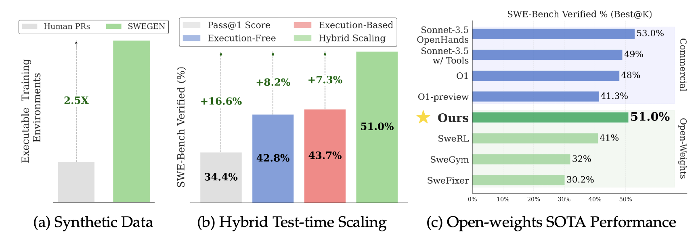
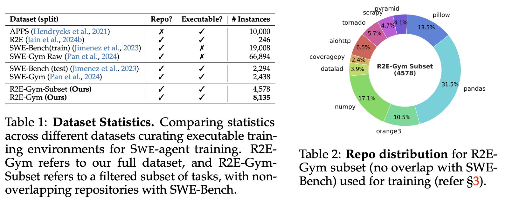
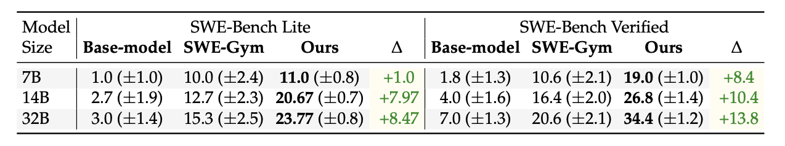
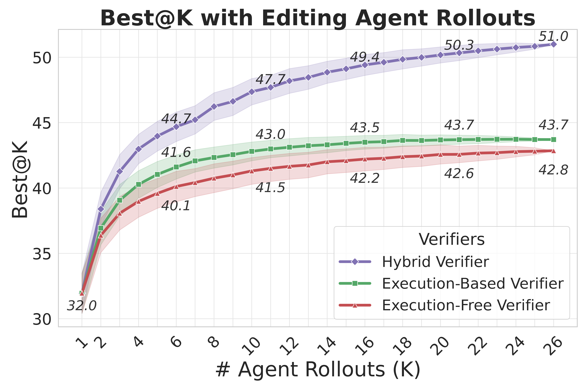

<h1 align="center"> R2E-Gym: Procedural Environment Generation and Hybrid Verifiers for Scaling Open-Weights SWE Agents </h1>

<p align="center">
  <a href="https://naman-ntc.github.io/" style="text-decoration: none;">Naman Jain<sup>*,1</sup></a>, 
  <a href="https://1jsingh.github.io/" style="text-decoration: none;">Jaskirat Singh<sup>*,2</sup></a>,
  <a href="https://manishs.org/" style="text-decoration: none;">Manish Shetty<sup>1</sup></a>,
  <a href="https://scholar.google.com/citations?user=vNHqr3oAAAAJ&hl=en" style="text-decoration: none;">Liang Zheng<sup>2</sup></a>,
  <a href="https://scholar.google.com/citations?user=Vn3L_ioAAAAJ&hl=en" style="text-decoration: none;">Koushik Sen<sup>1</sup></a>,
  <a href="https://scholar.google.com/citations?user=vN-is70AAAAJ&hl=en" style="text-decoration: none;">Ion Stoica<sup>1</sup></a>
</p>

<p align="center">
  <sup>1</sup>UC Berkeley, <sup>2</sup>ANU </br>
  <sub><sup>*</sup>Equal contribution, <sup>^</sup>Equal supervision</sub>
</p>

<!-- paper . data and models . project page -->
<p align="center">
<a href="./assets/paper.pdf">📃 Paper</a>
•
<a href="https://huggingface.co/R2E-Gym" >🤗 Data & Models</a>
•
<!-- project page -->
<a href="https://r2e-gym.github.io/" >🌐 Project Page</a>
</p>

---

We present **R2E-Gym**, the largest procedurally curated environment for training real-world SWE-Agents.
We show that R2E-Gym enables more scalable train and test-time scaling, achieving **51% on the SWE-Bench Verified benchmark**, reflecting a new state-of-the-art for open-weight SWE-Agents and for first time being competitive with proprietary models such as o1 and sonnet-3.5-v2 with tools.


<p align="left">
    <small>R2E-Gym is powered by two main contributions: (a) SWE-GEN: a synthetic data curation recipe for curating executable training environments w/o relying on human tests and issues. (b) Hybrid Inference Time Scaling: showing that while both execution-based and execution-free verifiers elicit inference-time gains; significantly better performance can be achieved by leveraging the strengths of both. (c) Overall, the final approach reflects SOTA performance for open-weight SWE-Agents, while also being competitive with some proprietary model baselines.</small>
</p>

---
<!-- >[!] -->
>  While LLM-based SWE-Agents have demonstrated remarkable improvements, state-of-the-art performance is largely driven by proprietary models — with open-models lagging behind. Closing this performance gap requires addressing two core challenges: First, we need scalable methods to curate diverse, high-quality execution environments for training. Second, we need efficient strategies for scaling test-time compute. R2EGym presents a joint framework for address both these challenges. 

## R2E-Gym Environment

We create R2E-Gym, the largest procedurally curated gym environment for training real-world SWE-Agents,  — consisting of more than **8.1K problems across 13 repos**, with executable gym environments, unit tests, and natural-language task descriptions.

<!-- add env stats -->
<!--  -->
<!--  -->

<div align="center">
  
</div>

## Synthetic Data Enables Scalable Agent Training

R2E-Gym is powered by **SWE-GEN — a novel synthetic data curation recipe** that enables collection of a large number of executable training environments without reliance on human-written pull requests (PRs) or unit tests. We show that instead of using human-written PRs, good-quality execution environments can directly be curated from **commits**. Compared to PR-based data collection, we find that this approach enables more scalable data curation and agent-training, resulting in a SOTA pass@1 performance of 34.4% on the challenging SWE-Bench Verified benchmark.

<!--  -->
<!--  -->

<div align="center">
  
</div>

## Hybrid Test-time Scaling

Finally, we introduce **Hybrid Test-time Scaling**, a novel paradigm for scaling test-time compute. We show that while both execution-based and execution-free verifiers elicit inference-time gains; they exchit complementary strengths and weakness. Leveraging the strengths of each approach allows significantly better performance when scaling test-time compute - resulting in a **51% pass@1 performance on the SWE-Bench Verified benchmark**, reflecting a new **state-of-the-art for open-weight SWE-Agents**.

<div align="center">
  
</div>

---

## 🔧 Setup
> [!IMPORTANT]
> Installation is required!

```bash
## Install uv
curl -LsSf https://astral.sh/uv/install.sh | sh
source $HOME/.local/bin/env

# activate venv
uv venv
source .venv/bin/activate
uv sync && uv pip install -e .
```

## 🚀 Quickstart
* **Usage**: R2E-Gym environment can be simply used as:
```python
from r2egym.agenthub.environment.env import EnvArgs, RepoEnv
from r2egym.agenthub.agent.agent import AgentArgs, Agent
from pathlib import Path
from datasets import load_dataset

# load gym dataset [R2E-Gym/R2E-Gym-Subset, R2E-Gym/R2E-Gym-Full, R2E-Gym/SWE-Bench-Verified, R2E-Gym/SWE-Bench-Lite]
ds = load_dataset("R2E-Gym/R2E-Gym-Lite")
split = 'train' # split of the dataset [train, test]

# load gym environment
env_index = 100 # index of the environment [0, len(ds)]
env_args = EnvArgs(ds = ds[split][env_index])
env = RepoEnv(env_args)

# load agent
agent_args = AgentArgs.from_yaml(Path('./src/r2egym/agenthub/config/edit_fn_calling.yaml'))
# define llm: ['claude-3-5-sonnet-20241022', 'gpt-4o', 'vllm/R2E-Gym/R2EGym-32B-Agent']
agent_args.llm_name = 'claude-3-5-sonnet-20241022'
agent = Agent(name="EditingAgent", args=agent_args)

# run the agent (note: disable fn_calling for R2E-Gym agents)
output = agent.run(env, max_steps=40, use_fn_calling=True)
```

> [!NOTE]
> The output of the agent is a `Trajectory` object, which contains detailed stats including full agent trajectory, problem statement, max execution time, exit-reason, and output patch. Please refer `src/r2egym/agenthub/agent/agent.py` and `src/r2egym/agenthub/trajectory/trajectory.py` for more details.

* **Reward Calculation:** All R2E-Gym environments support automated reward calculation using unit tests.
```python
# calculate reward
out = env.runtime._calculate_reward()
```

* **Gym Environment Stats**: The detailed stats for each environment (including natural language task description, repo name, ground truth patch) can be easily accessed as,
```python
# get the environment stats
env_stats_dict = env.get_stats()
```

> [!TIP]
> R2EGym environments also offer a range of other convenient functions, such as `apply_patch`, `get_gt_commit`, `reverse_patch` etc. Please refer `src/r2egym/agenthub/environment/env.py` and `src/r2egym/agenthub/runtime/runtime.py` for more details.


* **Trajectory Visualization**: We also provide flask app `apps/app.py` for visualizing the generated trajectories.
```python
# run the flask app
uv run apps/app.py
```
## 🔥 Training Open-Weight SWE-Agents

### Data Collection and Inference

* **Trajectory Collection**: R2E-Gym supports parallelized inference for training trajectory collection or evaluation. For instance to collect SFT trajectories on first 2000 R2E-Gym-Lite environments, run the following command:
```python
uv run python src/r2egym/agenthub/run/edit.py runagent_multiple \
  --traj_dir "./traj" \
  --max_workers 54 \
  --start_idx 0 \
  --k 2000 \
  --dataset "R2E-Gym/R2E-Gym-Lite" \
  --split "train" \
  --llm_name 'gpt-4o' \
  --use_fn_calling True \
  --exp_name r2egym-training-trajectories \
  --temperature 0.2 \
  --max_steps 40
```
> [!IMPORTANT]
> Please adjust the number of gym environments to be collected using `--k` argument. The above command will collect 2000 trajectories in parallel using 54 workers. Each executable gym instance has a docker image ~300MB-500Mb, so please ensure you have enough disk space.

Similarly, evaluation on SWE-Bench-Verified can be done using:
```bash
uv run python src/r2egym/agenthub/run/edit.py runagent_multiple \
  --traj_dir "./traj" \
  --max_workers 54 \
  --start_idx 0 \
  --k 500 \
  --dataset "R2E-Gym/SWE-Bench-Verified" \
  --split "test" \
  --llm_name 'vllm/R2E-Gym/R2EGym-32B-Agent' \
  --use_fn_calling False \
  --exp_name r2egym-32B-editingagent-swebv-eval \
  --temperature 0 \
  --max_steps 40
```

> [!NOTE]
> The above evaluation command will only generate the output trajectories and patches. Please use the official [SWE-Bench evaluation harness](https://github.com/SWE-bench/SWE-bench) script for final evaluation scores.

### 💻 Training

For ease of use, we provide precollected SFT trajectories using **claude-3-5-sonnet-20241022** for training different SWE-Agents and Verifiers, including:
1. **Code Editing Agent**: a general-purpose SWE-Agent for SWE tasks
2. **Execution-based Testing Agent**: a specialized testing agent for generating targeted unit tests.
3. **Execution-free Verifier Agent**: for reranking the generated patches in a training-free manner.

<!-- table below for two hf datasets one fro editing agent and other for testing agent -->
| Dataset                                                                                                                        | Description                                        |
| ------------------------------------------------------------------------------------------------------------------------------ | -------------------------------------------------- |
| 🤗 [R2E-Gym/R2EGym-SFT-Trajectories](https://huggingface.co/datasets/R2E-Gym/R2EGym-SFT-Trajectories)                           | SFT Trajectories for Editing Agent                 |
| 🤗 [R2E-Gym/R2EGym-TestingAgent-SFT-Trajectories](https://huggingface.co/datasets/R2E-Gym/R2EGym-TestingAgent-SFT-Trajectories) | SFT Trajectories for Execution-Based Testing Agent |
| 🤗 [R2E-Gym/R2EGym-Verifier-Trajectories](https://huggingface.co/datasets/R2E-Gym/R2EGym-Verifier-Trajectories)                 | SFT Trajectories for Execution-Free Verifier Agent |

> [!TIP]
> **Agent Training**: We provide easy to use config files for training your own agents using [LLaMA-Factory](https://github.com/hiyouga/LLaMA-Factory) on R2E-Gym trajectories.

First clone and install [LLaMA-Factory](https://github.com/hiyouga/LLaMA-Factory)
```bash
git clone --depth 1 https://github.com/hiyouga/LLaMA-Factory.git
cd LLaMA-Factory
pip install -e ".[torch,metrics]"
```

> [!TIP]
> Optional dependencies for faster training: flashattention2 (fa2), deepspeed, liger-kernel, unsloth


> [!NOTE]
> Please update `data/dataset_info.json` to use your custom dataset. For instance, we provide a reference `train/dataset_info.json` for different R2EGym datasets.


Train your own agents using provided config files in `train` folder. For instance, to train the general-purpose prompting SWE agent,
```bash
llamafactory-cli train train/train_r2egym_32B_agent.yaml
```

Similarly to train a specialized execution-based testing agent, run:
```bash
llamafactory-cli train train/train_r2egym_32B_testing_agent.yaml
```

## 🧪 Executable SWE Environment Generation
Please refer [ENV_GENERATION.md](docs/ENV_GENERATION.md) for details on SWE-GEN based environment generation.


## 📚 Citation

```bibtex
@misc{jain2025r2e-gym,
      title={R2E-Gym: Procedural Environment Generation and Hybrid Verifiers for Scaling Open-Weights SWE Agents},
      author={Jain Naman and Singh Jaskirat and Shetty Manish and Zheng Liang and Sen Koushik and Stoica Ion},
      year={2025},
      
}
```
